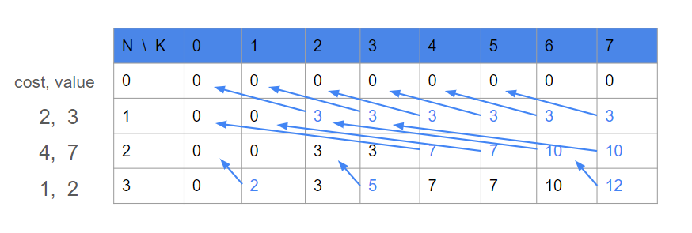

# Knapsack

### 0-1 Knapsack

<figure><figcaption></figcaption></figure>

```cpp
const int N, K;
int weight[N+1];
int value[K+1];
int dp[N+1][K+1] = {0};

// input ...

for (int i=1;i<=N;i++) {
    for (int j=K; j>=weight[i]; j--)
        dp[i][j] = max(dp[i-1][j], dp[i-1][j-weight[i]]+value[i]);
}
```


dp 테이블을 압축하여,  dp\[K] 를 in-place 로 갱신하는 구현도 가능

이 때, (높은 cost -> 낮은 cost) 순으로 갱신해야 현재 아이템을 중복으로 넣지 않을 수 있다

```cpp
const int N, K;
int weight[N+1];
int value[K+1];
int dp[K+1] = {0};

// input ...
for (int i=1;i<=N;i++) {
    for (int j=K; j>=weight[i]; j--)
        dp[j] = max(dp[j], dp[j-weight[i]]+value[i]);
}
```


### 0-K Knapsack

in-place 연산에서 (낮은 cost -> 높은 cost) 순으로 갱신

```cpp
const int N, K;
int weight[N+1];
int value[K+1];
int dp[K+1] = {0};

// input ...
for (int i=1;i<=N;i++) {
    for (int j=weight[i]; j<=K; j++)
        dp[j] = max(dp[j], dp[j-weight[i]]+value[i]);
}
```

